# Using IISCrossover to Migrate the MVC Music Store

This guide will cover the steps required to migrate the `/ShoppingCart` page of the MVC Music store application. Migrating this page demonstrates how to share the following concepts from ASP.NET with ASP.NET Core in the same website:

* Models
* Views
* Controllers
* Entity Framework entities
* Child Actions
* Session
* Identity

<!-- * Static content (css/js/images) -->

## General steps

1. Getting Started
1. Add the new ASP.NET Core Website
1. Setup IIS Crossover
1. Use Interfaces for System.Web Dependencies
1. Sharing Models, Controllers and Views
1. Updates to support Entity Framework
1. Convert Child Actions to View Components
1. Sharing Identity and Session
1. Demo Time

## Prerequisites

* Each section will provide a zip so that you can download a copy of the project before and after.

* This guide will use Visual Studio 2022 17.0.0 Preview 6.0 with the ASP.NET workload installed. [Download Visual Studio 2022 Preview](https://visualstudio.microsoft.com/vs/preview/)

* This guide will use .NET 6. If you decide to follow along with VS2019 please [install the latest SDK](https://dotnet.microsoft.com/download/dotnet/6.0).

<!-- TODO Find an appropriate VM, VS2022 VM may not be available until after .NET Conf -->
* You can also follow along by creating a new Visual Studio VM from the Azure Marketplace. [Create a VM](https://azuremarketplace.microsoft.com/en-us/marketplace/apps/microsoftvisualstudio.visualstudio2019latest?tab=Overview) 

* This guide will heavily follow the copy+paste model for adjusting the code. You may want to `git init` the sample to make the actual changes more visible as you follow along.

<br/>
<br/>

<!-- TODO requires all the following MvcMusicStore zip files & screenshots to be regenerated-->
## 1. Getting Started
1. Download the sample project [MvcMusicStore-v0.zip](https://mvcmusicstorestorage.blob.core.windows.net/app/MvcMusicStore-v0.zip)
2. Unzip, open the `MvcMusicStore.sln`
3. Right-Click to open the project properties for the ASP.NET Legacy App
4. Change the ASP.NET Legacy Web App to target .NET 4.8

    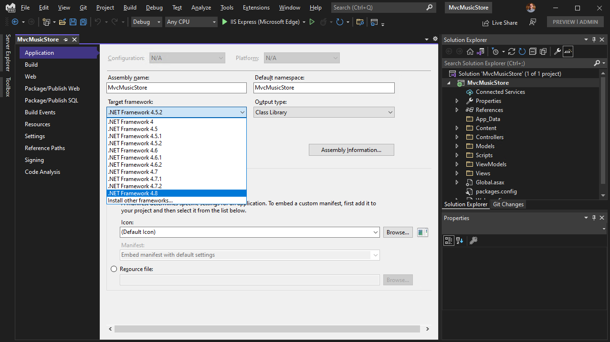

5. Right-Click references to **Manage NuGet Packages...**
6. Upgrade the NuGet package reference of Entity Framework to version 6.4.4

    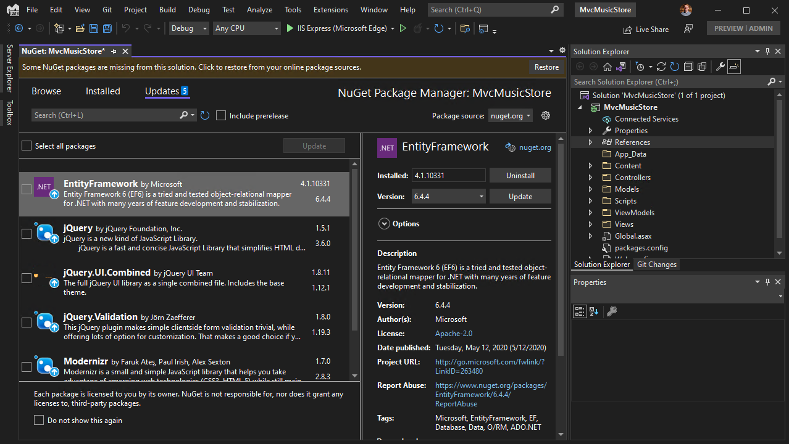

7. Open the `StoreManagerController.cs` **class**

* Fix the error on line 82 with the following code

```cs
        db.Entry(album).State = System.Data.Entity.EntityState.Modified;
```

8. Open the `_Layout.cshtml` file of the Legacy web app

* Replace the following section of code

```cs
    <div id="footer">
        built with <a href="http://asp.net/mvc">ASP.NET MVC 3</a>
    </div>
```

* With this code

```cs
    <div id="footer">
        Running on @System.Runtime.InteropServices.RuntimeInformation.FrameworkDescription
    </div>
```

9. Run the project and you should see the following

    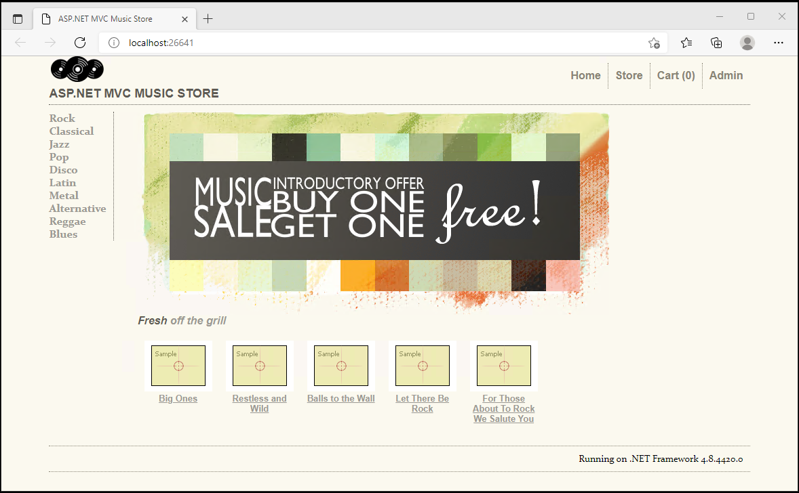

10. Stop the ASP.NET Legacy App

11. Your project should now look like [MvcMusicStore-v1.zip](https://mvcmusicstorestorage.blob.core.windows.net/app/MvcMusicStore-v1.zip)

<br/>
<br/>


## 2. Add the new ASP.NET Core Website

1. Add a new **ASP.NET Core Web App (Model-View-Controller)**

    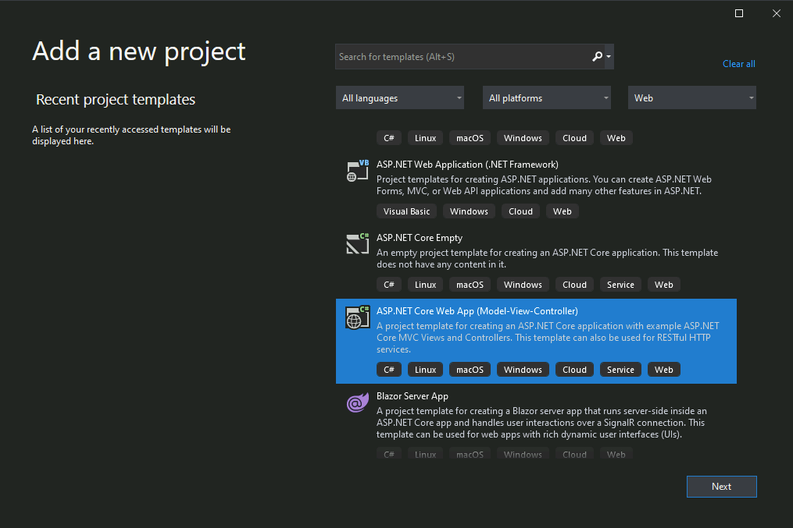

2. Set the **Project Name** to **MvcMusicStore.Core**

    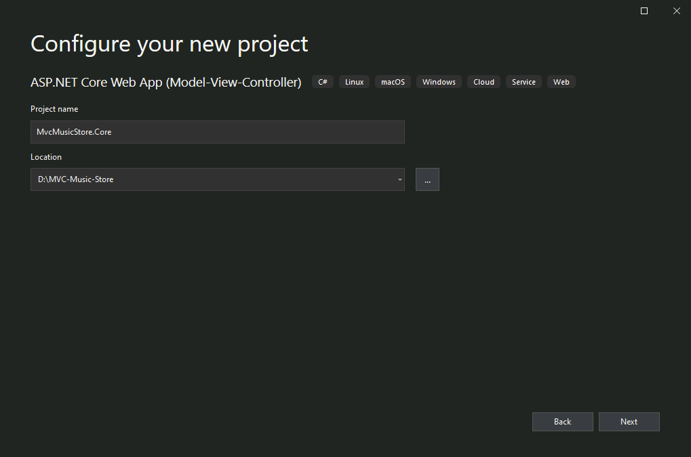

3. Choose .NET 6.0 and None as the **Authentication type**

    > Skip authentication which will be setup section of the guide

    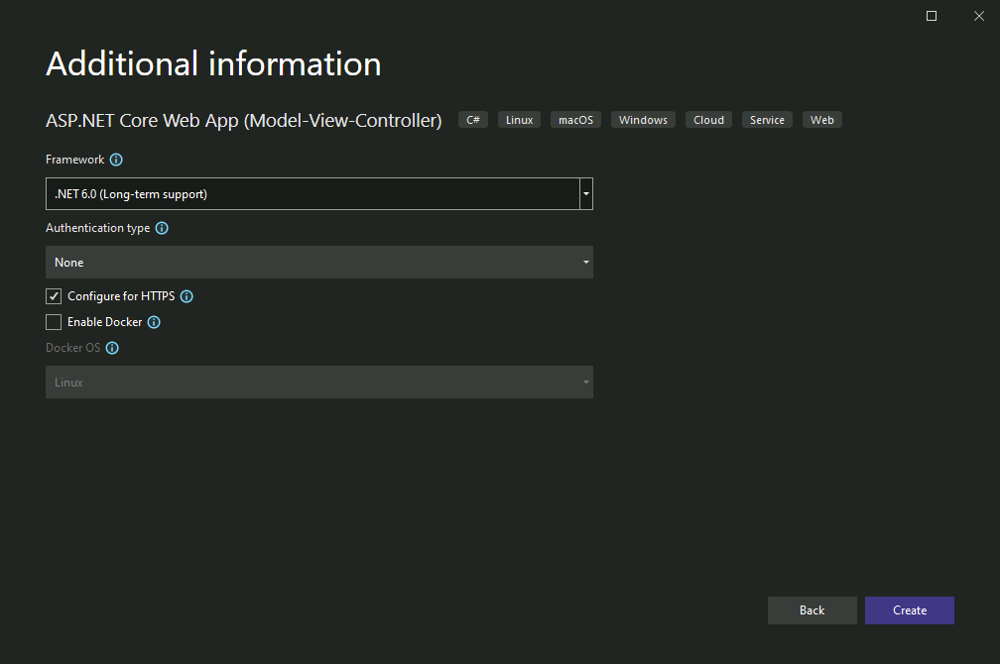

4. Click **Create** to add the new project

5. Right-click the ASP.NET Core web app and choose **Set as Startup Project**

6. Use the Visual Studio toolbar to set the new project to startup with IIS express

    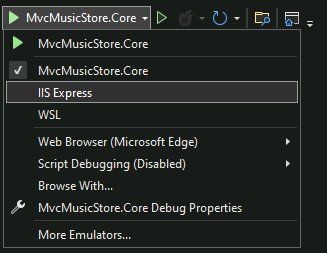

5. Start the Asp.NET Core web app

    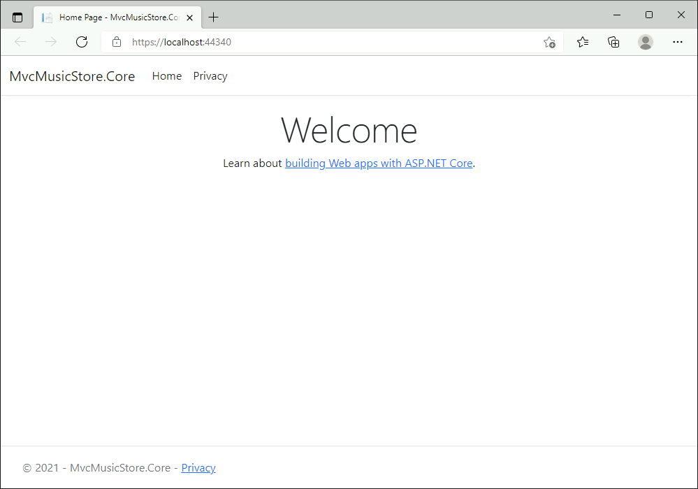

6. Your project should now look like [MvcMusicStore-v2.zip](https://mvcmusicstorestorage.blob.core.windows.net/app/MvcMusicStore-v2.zip)

<br/>
<br/>

## 3. Setup IIS Crossover

1. In Visual Studio go to **Tools-> Options** and search for `iis`

    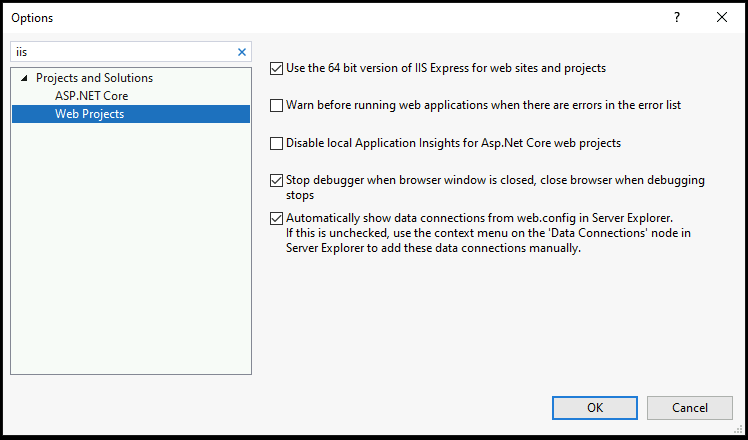

2. Make sure the **Use the 64 bit version of IIS Expres for websites and projects** option is checked

3. Find the `<system.webServer>` section in the `web.config` of the Legacy ASp.NET web app and replace it with the following.

* Replace the sction with the following code
    

    ```xml
    <system.webServer>
        <validation validateIntegratedModeConfiguration="false" />
        <modules runAllManagedModulesForAllRequests="true" />
        <!-- new content for IIS Crossover -->
        <handlers>
            <remove name="ExtensionlessUrlHandler-Integrated-4.0" />
            <remove name="OPTIONSVerbHandler" />
            <remove name="TRACEVerbHandler" />
            <add name="ExtensionlessUrlHandler-Integrated-4.0" path="*." verb="*" type="System.Web.Handlers.TransferRequestHandler" modules="AspNetCoreModuleV2" preCondition="integratedMode,runtimeVersionv4.0" />
        </handlers>
        <aspNetCore processPath="dotnet" arguments="..\MvcMusicStore.Core\bin\Debug\net6.0\MvcMusicStore.Core.dll --contentRoot ..\..\..\..\MvcMusicStore.Core --environment Development" stdoutLogEnabled="false" stdoutLogFile=".\logs\stdout" hostingModel="inprocess" />
    </system.webServer>
    ```

    > This section modifies the IIS request processing pipeline so that we can redirect endpoints from ASP.NET to ASP.NET Core.

4. In the `Global.asax.cs` add the following new method.

    ```cs
        private void Application_PostResolveRequestCache(object sender, EventArgs e)
        {
            // At this point we've set the handler to take this request, now if this route maps to one
            // we want to redirect to ASP.NET Core, so set the handler to null
            if (Context.Request.Path.Equals("/ShoppingCart", StringComparison.OrdinalIgnoreCase))
            {
                Context.RemapHandler(null);
            }
        }
    ```

    > This event handler will intercept requests to the `ShoppingCartController.cs` of the ASP.NET website and (by returning null) allow ASP.NET to attempt to handle the request.

5. Rename the `HomeController.cs` in the ASP.NET Core web app to `ShoppingCartController.cs`
6. Rename the `Views\Home` folder to `Views\ShoppingCart`
7. **Build** the ASP.NET Core Web app

    > Remember, the CSPROJ file of the Legacy ASP.NET web app does not know about the ASP.NET Core web app. You must build the ASP.NET Core web app everytime we want to test a change 

8. Start the Legacy ASP.NET web app and we should still see the same home page

    

9. Click on **Let There Be Rock** in the bottom row

10. Click on the **Add to cart** button to navigate to the **ShoppingCart** page

11. We should see that the Legacy ASP.NET web app used ASP.NET Core to serve the request!

    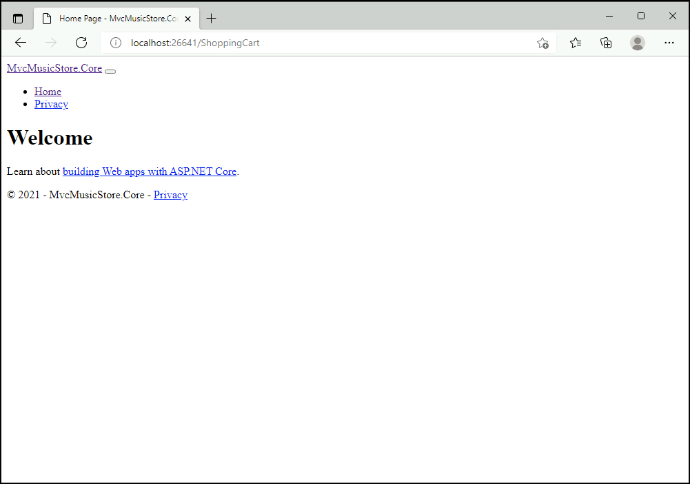

12. Your project should now look like [MvcMusicStore-v3.zip](https://mvcmusicstorestorage.blob.core.windows.net/app/MvcMusicStore-v3.zip)

<br/>
<br/>


## 4. Use Interfaces for System.Web Dependencies

1. Add a new **Folder** named **Interfaces** to the Legacy ASP.NET web app
2. Add a new **Interface** named **AspNetInterfaces** to the **Interfaces** folder

* Use the following to replace the contents of `AspNetInterfaces.cs`

```cs
namespace MvcMusicStore
{
    public interface IHttpContext
    {
        ISession Session { get; }

        IPrincipal User { get; }
    }
    
    public interface IIdentity
    {
        string Name { get; }
    }

    public interface IPrincipal
    {
        IIdentity Identity { get; }
    }
    
    public interface ISession
    {
        object this[string key] { get; set; }
    }
}
```

> We used one block of code to make the migration easier. You can separate these into different files if you choose.


3. Add a new **Folder** named **NetFrameworkDependencies** to the Legqacy ASP.NET web app

4. Add a new **Class** named **FrameworkDependentImpl** to the **NetFrameworkDependencies** folder

* Use the following to replace the contents of `FrameworkDependentImpl.cs`

```cs
using System.Web;

namespace MvcMusicStore
{
    public class HttpContextImpl : IHttpContext
    {
        private ISession _session = new SessionImpl();
        private IPrincipal _user = new PrincipalImpl();

        public ISession Session => _session;

        public IPrincipal User => _user;
    }

    public class IdentityImpl : IIdentity
    {
        public string Name
        {
            get
            {
                var name = HttpContext.Current.User.Identity.Name;

                if (name == null)
                {
                    return string.Empty;
                }

                return name;
            }
        }
    }

    public class PrincipalImpl : IPrincipal
    {
        IIdentity _identity = new IdentityImpl();

        public IIdentity Identity => _identity;
    }

    public class SessionImpl : ISession
    {
        public object this[string key]
        {
            get => HttpContext.Current.Session[key];
            set => HttpContext.Current.Session[key] = value;
        }
    }
}
```

> Now that we have abstractions for `System.Web` dependencies we will update the code to reference these classes

5. Open the `ShoppingCartController.cs` of the Legacy ASP.NET web app

* Add the following code

```cs
        private readonly IHttpContext _httpContext;

#if NETCOREAPP
        private readonly System.Text.Encodings.Web.HtmlEncoder _htmlEncoder;

        public ShoppingCartController(IHttpContext httpContext, System.Text.Encodings.Web.HtmlEncoder html)
        {
            _httpContext = httpContext ?? throw new ArgumentNullException(nameof(httpContext));
        }
#else
        public ShoppingCartController()
        {
            _httpContext = new HttpContextImpl();
        }
#endif
```

6. Replace all `HttpContext` references with `_httpContext`

* There are three lines that look like following code

```cs
        var cart = ShoppingCart.GetCart(this.HttpContext);
```

* Should be changed to the following code

```cs
        var cart = ShoppingCart.GetCart(this._httpContext);
```

7. Open the `AccountController.cs` class

* Add the following code and add the missing **MvcMusicStore** namespace and the following member variable

```cs
        private readonly IHttpContext _httpContext = new HttpContextImpl();
```

* Use `ctrl+.` to resolve the missing namespace

* Find the following code in the **AccountController**

```cs
        var cart = ShoppingCart.GetCart(this.HttpContext);
```

* Replace this line with the following code

```cs
        var cart = ShoppingCart.GetCart(this._httpContext);
```

8. Repeat Step 7 for the `CheckoutController.cs` to replace references to **System.Web.HttpContext** with the `IHttpContext` interface.

9. Open the `ShoppingCart.cs` class in the `\Models` folder

* Delete the following **GetCart** method

> The steps performed above should remove all references to this method


```cs
        public static ShoppingCart GetCart(Controller controller)
        {
            return GetCart(controller.HttpContext);
        }
```

* There should only be one **GetCart** method and it should be updated to use `IHttpContext`.

```cs
        public static ShoppingCart GetCart(IHttpContext context)
        {
            var cart = new ShoppingCart();
            cart.ShoppingCartId = cart.GetCartId(context);
            return cart;
        }
```

* The **GetCartId** method should be updated to use `IHttpContext`.

```cs
        // We're using HttpContextBase to allow access to cookies.
        public string GetCartId(IHttpContext context)
        {
            if (context.Session[CartSessionKey] == null)
            {
                if (!string.IsNullOrWhiteSpace(context.User.Identity.Name))
                {
                    context.Session[CartSessionKey] = context.User.Identity.Name;
                }
                else
                {
                    // Generate a new random GUID using System.Guid class
                    Guid tempCartId = Guid.NewGuid();

                    // Send tempCartId back to client as a cookie
                    context.Session[CartSessionKey] = tempCartId.ToString();
                }
            }

            return context.Session[CartSessionKey].ToString();
        }
```

10. Build the Legacy ASP.NET web app

> At this point the Legacy ASP.NET web app should compile successfully

11. Your project should now look like [MvcMusicStore-v4.zip](https://mvcmusicstorestorage.blob.core.windows.net/app/MvcMusicStore-v4.zip)

<br/>
<br/>

## 5. Sharing Models, Controllers and Views

1. From the ASP.NET Core website delete the following content:
    * All of the content from the `wwwroot` folder
    * The `ShoppingCartController.cs` file
    * The `Models\ErrorViewModel.cs` file
    * The `Views\Shared` folder and all nested content
    * The `Views\ShoppingCart` folder and all nested content

    Your ASP.NET Core website should now look like the following image.

    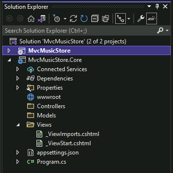

2. Right-click the `MvcMusicStore.Core.csproj` file and choose **Edit Project File**

* Replace the contents with the following

```xml
<Project Sdk="Microsoft.NET.Sdk.Web">

    <PropertyGroup>
        <TargetFramework>net6.0</TargetFramework>
        <Nullable>enable</Nullable>
        <ImplicitUsings>enable</ImplicitUsings>
    </PropertyGroup>

    <ItemGroup>
        <Folder Include="wwwroot\" />
    </ItemGroup>

    <!-- Reuse the same cshtml razor view files by creating a link from the ASP.NET Core project -->
    <ItemGroup>
        <Content Include="..\MvcMusicStore\Views\Shared\_Layout.cshtml" Link="Views\Shared\_Layout.cshtml" />
		<Content Include="..\MvcMusicStore\Views\ShoppingCart\Index.cshtml" Link="Views\ShoppingCart\Index.cshtml" />
        <Content Include="..\MvcMusicStore\Views\ShoppingCart\CartSummary.cshtml" Link="Views\Shared\Components\CartSummary\Default.cshtml" />
        <Content Include="..\MvcMusicStore\Views\Store\GenreMenu.cshtml" Link="Views\Shared\Components\GenreMenu\Default.cshtml" />
    </ItemGroup>

    <!-- Reuse the same controller class for the ShoppingCartController by creating a link from the ASP.NET Core project -->
    <ItemGroup>
        <Compile Include="..\MvcMusicStore\Controllers\ShoppingCartController.cs" Link="Controllers\ShoppingCartController.cs" />
    </ItemGroup>

    
    <!-- Reuse the same Interfaces for IHttpContext and web dependencies by creating a link from the ASP.NET Core project -->
    <ItemGroup>
        <!-- if you split these interfaces into distinct files then use those file names here instead of AspNetInterfaces.cs -->
        <Compile Include="..\MvcMusicStore\Interfaces\AspNetInterfaces.cs" Link="Interfaces\AspNetInterfaces.cs" />
    </ItemGroup>

    <!-- Reuse the same Models and ViewModels by creating a link from the ASP.NET Core project -->
    <ItemGroup>
        <Compile Include="..\MvcMusicStore\Models\AccountModels.cs" Link="Models\AccountModels.cs" />
        <Compile Include="..\MvcMusicStore\Models\Album.cs" Link="Models\Album.cs" />
        <Compile Include="..\MvcMusicStore\Models\Artist.cs" Link="Models\Artist.cs" />
        <Compile Include="..\MvcMusicStore\Models\Cart.cs" Link="Models\Cart.cs" />
        <Compile Include="..\MvcMusicStore\Models\Genre.cs" Link="Models\Genre.cs" />
        <Compile Include="..\MvcMusicStore\Models\MusicStoreEntities.cs" Link="Models\MusicStoreEntities.cs" />
        <Compile Include="..\MvcMusicStore\Models\Order.cs" Link="Models\Order.cs" />
        <Compile Include="..\MvcMusicStore\Models\OrderDetail.cs" Link="Models\OrderDetail.cs" />
        <Compile Include="..\MvcMusicStore\Models\SampleData.cs" Link="Models\SampleData.cs" />
        <Compile Include="..\MvcMusicStore\Models\ShoppingCart.cs" Link="Models\ShoppingCart.cs" />
        <Compile Include="..\MvcMusicStore\ViewModels\ShoppingCartRemoveViewModel.cs" Link="ViewModels\ShoppingCartRemoveViewModel.cs" />
        <Compile Include="..\MvcMusicStore\ViewModels\ShoppingCartViewModel.cs" Link="ViewModels\ShoppingCartViewModel.cs" />
    </ItemGroup>
    
    <!-- we need to share the entities between projects by upgrading EF to a version that supports .NET Standard -->
    <ItemGroup>
        <PackageReference Include="EntityFramework" Version="6.4.4" />
    </ItemGroup>
</Project>
```

3. Add a new text file file named **placeholder.txt** to the the `wwwroot` folder which will later be used for all static files (e.g. css, js, gif, ico).

4. Open the `\Views\_ViewImports.cshtml` file of the ASP.NET Core web app

* Replace the contents of the file with the following

```
@using MvcMusicStore
@using MvcMusicStore.Models
@addTagHelper *, Microsoft.AspNetCore.Mvc.TagHelpers
```

> We're reusing the same models which means we're reusing the same namespaces

5. Open the `\Models\Order.cs` **class** in the Legacy ASP.NET web app

* Surround the `System.Web.Mvc` using statement as shown by this example

```cs
#if !NETCOREAPP
using System.Web.Mvc;
#endif
```
<!-- TODO review if this should switch to include syntax -->

* Surround the `[Bind(Exclude = "OrderId")]` attribute as shown by this example

```cs
#if !NETCOREAPP
    [Bind(Exclude = "OrderId")]
#endif
```

6. Open the `\Models\Album.cs` file in the Legacy ASP.NET web app and repeat Step 5

7. Open the `\Models\AccountModels.cs` file in the Legacy ASP.NET web app and repeat Step 5

7. Open `\Models\ShoppingCart.cs` file in the Legacy ASP.NET web app

* Remove the unused namespace imports which will fix the errors to referencing `System.Web.Mvc` and `System.Web.Security`.

> If you use the Visual Studio refactor tool to **Remove and Sort Usings** while MvcMusicStore.Core is selected then you may inadvertently remove the `using Sytem.Linq;` line which will cause build errors in the Legacy ASP.NET web app because it does not leverage C# default includes.

8. Open the `ShoppingCartController.cs` in the Legacy ASP.NET web app

* Surround the `System.Web.Mvc` using statement as shown by this example which  resolves the `Controller` base class for both ASP.NET and ASP.NET Core projects.

```cs
#if NETCOREAPP
using Microsoft.AspNetCore.Mvc;
#else
using System.Web.Mvc;
#endif
```

<!-- TODO validate the _htmlEncoder in ASP.NET Core -->
* Fix the **Message** property in the **RemoveFromCart** method

* The following code

```cs
            var results = new ShoppingCartRemoveViewModel
            {
                Message = Server.HtmlEncode(albumName) +
                    " has been removed from your shopping cart.",
                CartTotal = cart.GetTotal(),
                CartCount = cart.GetCount(),
                ItemCount = itemCount,
                DeleteId = id
            };
```

* Should be replaced with this code

```cs
            var results = new ShoppingCartRemoveViewModel
            {
#if NETCOREAPP
                Message = _htmlEncoder.Encode(albumName) + " has been removed from your shopping cart.",
#else
                Message = Server.HtmlEncode(albumName) + " has been removed from your shopping cart.",
#endif
                CartTotal = cart.GetTotal(),
                CartCount = cart.GetCount(),
                ItemCount = itemCount,
                DeleteId = id
            };
```

* Surround the `[ChildActionOnly]` attribute on the **CartSummary** method as shown by this example which  hides this component for both ASP.NET and ASP.NET Core projects.

```cs
#if NETCOREAPP
        [NonAction]
#else
        [ChildActionOnly]
#endif
```

6. Build the Legacy ASP.NET web app

* Remove any unused namespaces and use preprocessor directives to surround any remaining features not supported in ASP.NET Core

    > At this point the Legacy ASP.NET web app should compile successfully
    > The ASP.NET Core web app will not compile until after we fix the `[ChildActions]` of the **ShoppingCartController**

7. Your project should now look like [MvcMusicStore-v5.zip](https://mvcmusicstorestorage.blob.core.windows.net/app/MvcMusicStore-v5.zip)

    > The ASP.NET Core app is not quite ready for testing. Now that we are sharing the Models, Controller, and Views we need to migrate the **ChildActions** for the *Genre Menu* and the *Cart Summary*.


<br/>
<br/>


<!-- TODO standardize on naming update, upgrade, migrate etc -->
## 6. Updates to support Entity Framework

1. Open the `appsettings.json` file in the ASP.NET Core web app

* Use the following to replace the contents of the `appsettings.json` file

    > This adds the **ConnectionStrings** section

```json
{
  "Logging": {
    "LogLevel": {
      "Default": "Information",
      "Microsoft.AspNetCore": "Warning"
    }
  },
  "AllowedHosts": "*",
  "ConnectionStrings": {
    "MusicStoreEntities": "Server=(LocalDB)\\MSSQLLocalDB;AttachDbFilename=|DataDirectory|\\MvcMusicStore.mdf;Integrated Security=True"
  }
}
```

2. Open the `Program.cs` class

* Add the following block of code

```cs
var startup = new Startup(builder.Configuration);
builder.WebHost.ConfigureAppConfiguration(config =>
{
    // Fix up the data directory in config, EF6 on .NET Core doesn't seem to like it
    // (we get ArgumentException: Invalid value for key 'attachdbfilename'.). Follow up with the EF team.

    using var tempConfig = (ConfigurationManager)config.Build();

    var connectionStringKey = "ConnectionStrings:MusicStoreEntities";

    var value = tempConfig[connectionStringKey];

    // Fix up the connection string's path to the data directory
    value = value.Replace("|DataDirectory|", $"{Directory.GetCurrentDirectory()}\\App_Data");

    config.AddInMemoryCollection(new Dictionary<string, string>
                      {
                          { connectionStringKey, value }
                      });
});

builder.Services.AddControllersWithViews();
```

> This modifies the configuration so that the path to the connection string will replace the string place holder `|DataDirectory|` with one that Entity Framework will understand in ASP.NET Core

3. Add a new **class** named **Startup**

4. Use the following to replace the contents of `Startup.cs`

```cs
namespace MvcMusicStore.Core
{
    /// <summary>
    /// https://gist.github.com/davidfowl/0e0372c3c1d895c3ce195ba983b1e03d#i-like-the-startup-class-can-i-keep-it
    /// </summary>
    public class Startup
    {
        public Startup(IConfiguration configuration)
        {
            Configuration = configuration;
        }

        // REVIEW: This is bad, and we should feel bad, but we're making minimal change at the moment
        public static IConfiguration Configuration { get; private set; }
    }
}
```

5. Open the `MusicStoreEntities.cs` class

* Use the following code to replace the contents of the file

```cs
using System.Data.Entity;
#if NETCOREAPP
using Microsoft.Extensions.Configuration;
using MvcMusicStore.Core;
#endif

namespace MvcMusicStore.Models
{
    public class MusicStoreEntities : DbContext
    {
#if NETCOREAPP
        // TODO: Use constructor injection...
        public MusicStoreEntities() : 
            base(Startup.Configuration.GetConnectionString(nameof(MusicStoreEntities)))
        {

        }
#endif
        public DbSet<Album> Albums { get; set; }
        public DbSet<Genre> Genres { get; set; }
        public DbSet<Artist> Artists { get; set; }
        public DbSet<Cart> Carts { get; set; }
        public DbSet<Order> Orders { get; set; }
        public DbSet<OrderDetail> OrderDetails { get; set; }
    }
}
```

6. Your project should now look like [MvcMusicStore-v6.zip](https://mvcmusicstorestorage.blob.core.windows.net/app/MvcMusicStore-v6.zip)


<br/>
<br/>

## 7. Using View Components for Child Actions

1. Add a new **Folder** named **ViewComponents** to the ASP.NET Core web app
2. Add a new **Class** named **CartSummaryViewComponent** to the ASP.NET Core web app

* Use the following to replace the contents of `CartSummaryViewComponent.cs`

```cs
using Microsoft.AspNetCore.Mvc;
using MvcMusicStore.Models;

namespace MvcMusicStore.Core.ViewComponents
{
    public class CartSummaryViewComponent : ViewComponent
    {
        private readonly IHttpContext _httpContext;

        public CartSummaryViewComponent(IHttpContext httpContext)
        {
            _httpContext = httpContext;
        }

        public IViewComponentResult Invoke(int numberOfItems)
        {
            var cart = ShoppingCart.GetCart(_httpContext);

            ViewData["CartCount"] = cart.GetCount();
            return View();
        }
    }
}
```
> Note that the associated view is located in `\Views\Shared\Components\CartSummary\Default.cshtml` and was setup by the csproj file changes made earlier.

4. Add a new **Class** named **GenreMenuViewComponent** to the ASP.NET Core Web app

* Use the following to replace the contents of `GenreMenuViewComponent.cs`

```cs
using Microsoft.AspNetCore.Mvc;
using MvcMusicStore.Models;

namespace MvcMusicStore.Core.ViewComponents
{
    public class GenreMenuViewComponent : ViewComponent
    {
        private MusicStoreEntities storeDB = new MusicStoreEntities();

        public IViewComponentResult Invoke(int numberOfItems)
        {
            var genres = storeDB.Genres.ToList();
            return View(genres);
        }
    }
}
```

> Note that the associated view is located in `\Views\Shared\Components\CartSummary\Default.cshtml` and was setup by the csproj file changes made earlier.

6. Open the `_Layout.cshtml` file in the `Views` folder

> There is only one version now because the file is shared by both projects

* Fix the Child Action reference for **CartSummary**

```cs
             @{Html.RenderAction("CartSummary", "ShoppingCart");}
```

* Replace the previous code with the following

```cs
             @{
                #if NETCOREAPP
                    <text>@await Component.InvokeAsync("CartSummary")</text>
                #else
                    @Html.RenderAction("CartSummary", "ShoppingCart");
                #endif
            }   
```

* Fix the Child Action reference for **GenreMenu**

```cs
    @{Html.RenderAction("GenreMenu", "Store");}
```

* Replace the previous code with the following

```cs
    @{
        #if NETCOREAPP
            <text>@await Component.InvokeAsync("GenreMenu")</text>
        #else
            @Html.RenderAction("GenreMenu", "Store");
        #endif
    }
```
7. Build the ASP.NET Core web app

> At this point the Legacy ASP.NET web app should compile successfully

* Remove any unused namespaces and use preprocessor directives to surround any remaining features not supported in ASP.NET Core

8. Your project should now look like [MvcMusicStore-v7.zip](https://mvcmusicstorestorage.blob.core.windows.net/app/MvcMusicStore-v7.zip)

> The ASP.NET Core app is not quite ready for testing. Now that we are sharing the Models, Controller, and Views we need to support sharing of **Session** and **Identity** for authenticated users before the page will render correctly.

<br/>
<br/>

## 8. Sharing Identity and Session

1. Add a new **Folder** named **NetCoreDependencies** to the ASP.NET Core web app

2. Add a new **Class** named **NetCoreImpl** to the `NetCoreDependencies` folder

3. Use the following code to replace the contents of `NetCoreImpl.cs`

```cs
using System.Text;

namespace MvcMusicStore.Core
{
    public class HttpContextImpl : IHttpContext
    {
        private ISession _session;
        private IPrincipal _user;

        public HttpContextImpl(IHttpContextAccessor httpContextAccessor)
        {
            if (httpContextAccessor is null)
            {
                throw new ArgumentNullException(nameof(httpContextAccessor));
            }

            _session = new SessionImpl(httpContextAccessor);

            _user = new PrincipalImpl(httpContextAccessor);
        }

        public ISession Session => _session;

        public IPrincipal User => _user;
    }

    public class IdentityImpl : IIdentity
    {
        private string? _name;

        public IdentityImpl(IHttpContextAccessor httpContextAccessor)
        {
            if (httpContextAccessor is null)
            {
                throw new ArgumentNullException(nameof(httpContextAccessor));
            }

            _name = httpContextAccessor.HttpContext?.User?.Identity?.Name;
        }

        public string Name => _name ?? string.Empty;
    }

    public class PrincipalImpl : IPrincipal
    {
        private readonly IIdentity _identity;

        public PrincipalImpl(IHttpContextAccessor httpContextAccessor)
        {
            if (httpContextAccessor is null)
            {
                throw new ArgumentNullException(nameof(httpContextAccessor));
            }

            _identity = new IdentityImpl(httpContextAccessor);

        }

        public IIdentity Identity => _identity;
    }

    public class SessionImpl : ISession
    {
        private readonly IHttpContextAccessor _httpContextAccessor;

        public SessionImpl(IHttpContextAccessor httpContextAccessor)
        {
            _httpContextAccessor = httpContextAccessor ?? throw new ArgumentNullException(nameof(httpContextAccessor));
        }

        public object this[string key]
        {
            // TODO: Support more than just strings
            get => Encoding.UTF8.GetString(_httpContextAccessor.HttpContext.Session.Get(key));

            set
            {
                if (!(value is string))
                {
                    throw new NotSupportedException();
                }

                _httpContextAccessor.HttpContext.Session.Set(key, Encoding.UTF8.GetBytes((string)value));
            }
        }
    }
}
```

4. Add a new **Folder** named **IISCrossover** to the Legacy ASP.NET web app

5. Add a new **Class** named **AuthenticationBridge** to the `IISCrossover` folder of the Legacy ASP.NET web app

6. Use the following code to replace the contents of `AuthenticationBridge.cs`

```cs
using System;
using System.IO;
using System.Security.Claims;
using System.Web;

namespace MvcMusicStore
{
    public class AuthenticationBridge
    {
        // This magic string can be any value as long as it is unique and shared between the two websites.
        private const string IISCrossoverClaims = "IISCrossover.Claims.77a297cf-0651-4fb6-9c83-73a716e7a2f9";

        public static void ShareUser(HttpContext context)
        {
            if (context == null)
                return;

            var claimsPrincipal = context?.User as ClaimsPrincipal;
            if (claimsPrincipal != null)
            {
                var ms = new MemoryStream();
                var writer = new BinaryWriter(ms);
                claimsPrincipal.WriteTo(writer);

                var serialized = Convert.ToBase64String(ms.ToArray());
                
                context.Request.ServerVariables[IISCrossoverClaims] = serialized;
            }
        }
    }
}
```

7. Add a new **Class** named **SessionBridge** to the `IISCrossover` folder of the Legacy ASP.NET web app

8. Use the following code to replace the contents of `SessionBridge.cs`

```cs
using System.Collections.Generic;
using System.Text.Json;
using System.Web;

namespace MvcMusicStore
{
    public static class SessionBridge
    {
        // This magic string can be any value as long as it is unique and shared between the two websites.
        private const string IISCrossoverSession = "IISCrossover.Session.77a297cf-0651-4fb6-9c83-73a716e7a2f9";

        public static void ShareSession(HttpContext context)
        {
            if (context == null || context.Session == null || context.Session.Count == 0)
            {
                return;
            }

            var dictionary = new Dictionary<string, object>();
            foreach (var key in context.Session.Keys)
            {
                var keyString = key.ToString();
                dictionary.Add(keyString, context.Session[keyString]);
            }

            var sessionString = JsonSerializer.Serialize(dictionary);
            context.Request.ServerVariables[IISCrossoverSession] = sessionString;
        }
    }
}
```

9. Right-Click the Legacy ASP.NET web app and choose **Manage NuGet packages...**

<!-- TODO - consider a different serialization format which installs fewer dependencies -->
* Install the latest version of **System.Text.Json**

10. Open the `Global.asax.cs` class

* Add the following code

```cs
        private void Application_AcquireRequestState(object sender, EventArgs e)
        {
            if (Context.Request.Path.StartsWith("/ShoppingCart", StringComparison.OrdinalIgnoreCase))
            {
                SessionBridge.ShareSession(Context);
            }
        }
```

* Replace the **Application_PostResolveRequestCache** method

```cs
        private void Application_PostResolveRequestCache(object sender, EventArgs e)
        {
            // At this point we've set the handler to take this request, now if this route maps to one
            // we want to redirect to ASP.NET Core, so set the handler to null
            if (Context.Request.Path.StartsWith("/ShoppingCart", StringComparison.OrdinalIgnoreCase))
            {
                // We want to share session for requests that make it to ASP.NET Core
                Context.SetSessionStateBehavior(SessionStateBehavior.Required);

                AuthenticationBridge.ShareUser(Context);

                Context.RemapHandler(null);
            }
        }
```
> Use ctrl + . to resolve the missing namespace for `SessionStateBehavior`

11. Add a new **Folder** named **IISCrossover** to the ASP.NET Core web app

12. Add a new **Class** named **IISCrossoverAuthenticationHandler** to the `IISCrossover` folder of the ASP.NET Core web app

13. Use the following code to replace the contents of `IISCrossoverAuthenticationHandler.cs`

```cs
using Microsoft.AspNetCore.Authentication;
using Microsoft.Extensions.Options;
using System.Security.Claims;
using System.Text.Encodings.Web;

namespace MvcMusicStore.Core
{
    public static class IISCrossoverAuthenticationDefaults
    {
        /// <summary>
        /// The default value used for AuthenticationSchemeOptions.AuthenticationScheme
        /// </summary>
        public const string AuthenticationScheme = "IISCrossOver";
    }

    public class IISCrossoverAuthenticationSchemeOptions
        : AuthenticationSchemeOptions
    {
    }

    public class IISCrossoverAuthenticationHandler
        : AuthenticationHandler<IISCrossoverAuthenticationSchemeOptions>
    {

        // This magic string can be any value as long as it is unique and shared between the two websites.
        private const string IISCrossovrClaims = "IISCrossover.Claims.77a297cf-0651-4fb6-9c83-73a716e7a2f9";

        public IISCrossoverAuthenticationHandler(
            IOptionsMonitor<IISCrossoverAuthenticationSchemeOptions> options,
            ILoggerFactory logger,
            UrlEncoder encoder,
            ISystemClock clock)
            : base(options, logger, encoder, clock)
        {
        }

        protected override Task<AuthenticateResult> HandleAuthenticateAsync()
        {
            var serializedClaimsPrincipal = Context.GetServerVariable(IISCrossovrClaims);
            ClaimsPrincipal claimsPrincipal = null;

            if (serializedClaimsPrincipal != null)
            {
                try
                {
                    var bytes = Convert.FromBase64String(serializedClaimsPrincipal);

                    claimsPrincipal = new ClaimsPrincipal(new BinaryReader(new MemoryStream(bytes)));
                }
                catch
                {
                    return Task.FromResult(AuthenticateResult.Fail("Unable to process authenticated user from server variable."));
                }
            }

            if (claimsPrincipal != null)
            {
                // generate AuthenticationTicket from the Identity and current authentication scheme
                var ticket = new AuthenticationTicket(claimsPrincipal, Scheme.Name);

                // pass on the ticket to the middleware
                return Task.FromResult(AuthenticateResult.Success(ticket));
            }

            return Task.FromResult(AuthenticateResult.NoResult());
        }
    }
}
```

14. Add a new **Class** named **IISCrossoverSession** to the `IISCrossover` folder of the ASP.NET Core web app

15. Use the following to replace the contents of `IISCrossoverSession.cs`

```cs
using System;
using System.Collections.Generic;
using System.Text;
using System.Threading;
using System.Threading.Tasks;

namespace MvcMusicStore.Core
{
    internal class IISCrossoverSession : Microsoft.AspNetCore.Http.ISession
    {
        private Dictionary<string, string> _aspNetFrameworkSession;

        public IISCrossoverSession(Dictionary<string, string> aspNetFrameworkSession)
        {
            _aspNetFrameworkSession = aspNetFrameworkSession;
        }

        public string Id => throw new NotImplementedException();

        public bool IsAvailable => true;

        public IEnumerable<string> Keys => _aspNetFrameworkSession.Keys;

        public void Clear()
        {
            // no-op
        }

        public Task CommitAsync(CancellationToken cancellationToken = default)
        {
            return Task.CompletedTask;
        }

        public Task LoadAsync(CancellationToken cancellationToken = default)
        {
            return Task.CompletedTask;
        }

        public void Remove(string key)
        {
            // no-op
        }

        public void Set(string key, byte[] value)
        {
            // no-op
        }

        public bool TryGetValue(string key, out byte[] value)
        {
            if (_aspNetFrameworkSession.TryGetValue(key, out var raw))
            {
                // REVIEW: Can we do this once per key
                value = Encoding.UTF8.GetBytes(raw);
                return true;
            }
            value = null;
            return false;
        }
    }
}
```

16. Add a new **Class** named **IISCrossoverSessionMiddleware** to the `IISCrossover` folder of the ASP.NET Core web app

17. Use the following to replace the contents of `IISCrossoverSessionMiddleware.cs`

```cs
using Microsoft.AspNetCore.Http.Features;
using Microsoft.AspNetCore.Session;
using System.Text.Json;

namespace MvcMusicStore.Core
{
    public class IISCrossoverSessionMiddleware
    {
        // This magic string can be any value as long as it is unique and shared between the two websites.
        private const string IISCrossoverSession = "IISCrossover.Session.77a297cf-0651-4fb6-9c83-73a716e7a2f9";

        private readonly RequestDelegate _next;

        public IISCrossoverSessionMiddleware(RequestDelegate next)
        {
            _next = next;
        }

        public Task InvokeAsync(HttpContext context)
        {
            var sessionString = context.GetServerVariable(IISCrossoverSession);
            if (sessionString != null)
            {
                var aspNetFrameworkSession = JsonSerializer.Deserialize<Dictionary<string, string>>(sessionString);
                if (aspNetFrameworkSession != null)
                {
                    var crossOverSession = new IISCrossoverSession(aspNetFrameworkSession);
                    context.Features.Set<ISessionFeature>(new SessionFeature() { Session = crossOverSession });
                }
            }

            return _next(context);
        }
    }
}
```

18. Add a new **Class** named **IISCrossoverExtensions**

19. Use the following to replace the contents of `IISCrossoverExtensions.cs`

```cs
using Microsoft.AspNetCore.Authentication;

namespace MvcMusicStore.Core
{
    public static class IISCrossoverExtensions
    {
        public static AuthenticationBuilder AddIISCrossoverAuthentication(this AuthenticationBuilder builder)
            => builder.AddScheme<IISCrossoverAuthenticationSchemeOptions, IISCrossoverAuthenticationHandler>(IISCrossoverAuthenticationDefaults.AuthenticationScheme, op => { });

        public static IApplicationBuilder UseIISCrossoverSession(this IApplicationBuilder app)
            => app.UseMiddleware<IISCrossoverSessionMiddleware>();
    }
}
```

20. Open the `Program.cs` class in the ASP.NET Core Web App

* Use the following to replace the contents of `Program.cs`

```cs
using MvcMusicStore;
using MvcMusicStore.Core;

var builder = WebApplication.CreateBuilder(args);

var startup = new Startup(builder.Configuration);
builder.WebHost.ConfigureAppConfiguration(config =>
{
    // Fix up the data directory in config, EF6 on .NET Core doesn't seem to like it
    // (we get ArgumentException: Invalid value for key 'attachdbfilename'.). Follow up with the EF team.

    using var tempConfig = (ConfigurationManager)config.Build();

    var connectionStringKey = "ConnectionStrings:MusicStoreEntities";

    var value = tempConfig[connectionStringKey];
    
    // Fix up the connection string's path to the data directory
    value = value.Replace("|DataDirectory|", $"{Directory.GetCurrentDirectory()}\\App_Data");

    config.AddInMemoryCollection(new Dictionary<string, string>
                      {
                          { connectionStringKey, value }
                      });
});

// Add services to the container.
builder.Services.AddControllersWithViews();

builder.Services.AddAuthentication(IISCrossoverAuthenticationDefaults.AuthenticationScheme)
    .AddIISCrossoverAuthentication();
builder.Services.AddHttpContextAccessor();
builder.Services.AddScoped(typeof(IHttpContext), typeof(HttpContextImpl));

var app = builder.Build();

// Configure the HTTP request pipeline.
if (!app.Environment.IsDevelopment())
{
    app.UseExceptionHandler("/Home/Error");
    // The default HSTS value is 30 days. You may want to change this for production scenarios, see https://aka.ms/aspnetcore-hsts.
    app.UseHsts();
}

app.UseIISCrossoverSession();

app.UseHttpsRedirection();
app.UseStaticFiles();

app.UseRouting();

app.UseAuthentication();
app.UseAuthorization();

app.MapControllerRoute(
    name: "default",
    pattern: "{controller=Home}/{action=Index}/{id?}");

app.Run();
```

21. Build the Legacy ASP.NET web app

> At this point the ASP.NET Legacy Web app should compile successfully

22. Build the ASP.NET Core web app

> At this point the ASP.NET Legacy Web app should compile successfully

23. Your project should now look like [MvcMusicStore-v8.zip](https://mvcmusicstorestorage.blob.core.windows.net/app/MvcMusicStore-v8.zip)


<br/>
<br/>

## 9. Demo Time
<!-- TODO Standardize naming of Legacy Web App and ASP.NET Core Web App -->
1. Build the ASP.NET Core web app

2. Start the Legacy ASP.NET web app and wait for the page to load


3. Click on **Let There Be Rock** in the bottom row

4. Click on the **Add to cart** button

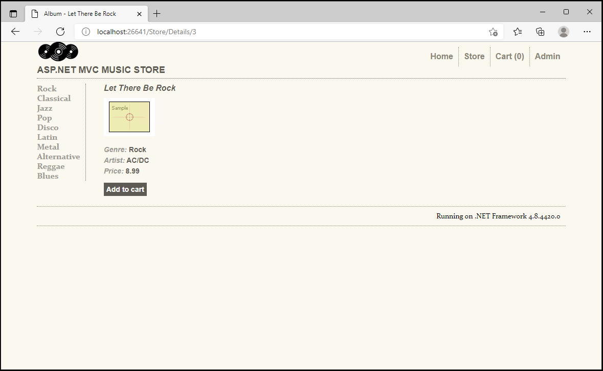

5. Go to the Shopping Cart page

6. Observe IIS Crossover in action

* The **ShoppingCartController.cs** just handled the request from ASP.NET Core
* The same **_Layout.cshtml** is shared between the two websites so all of the css and javascript files were successfully downloaded
* The page shows 1 item in your shopping cart which means
    * The ASP.NET Core Web App can access the database using Entity Framework
    * The ASP.NET Core Web App found the correct data from your current session


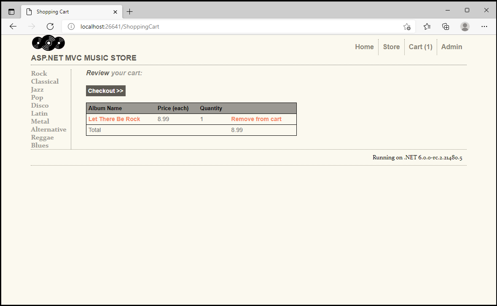


<br />
<br />
<br />


# Troubleshooting

## 1. The ASP.NET Core App won't start

These tips apply if you see something similar to the following when trying to navigate to an ASP.NET Core page.

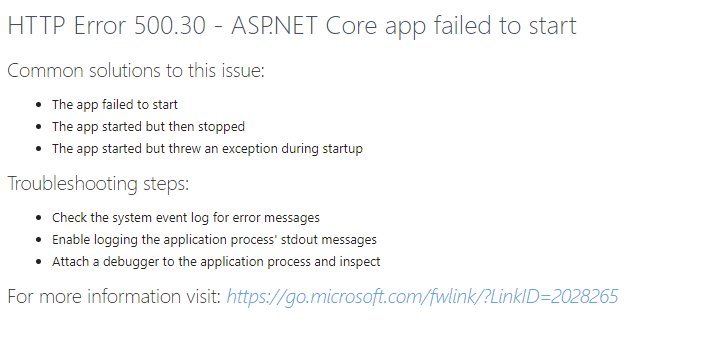

> Try building the ASP.NET Core app and then restarting the ASP.NET Website.

### Additional Tips

1. Try to start the ASP.NET Core Website directly. You may get a better error message.

    This example shows that the views could not be found for the new ASP.NET Core `ShoppingCartController.cs`

    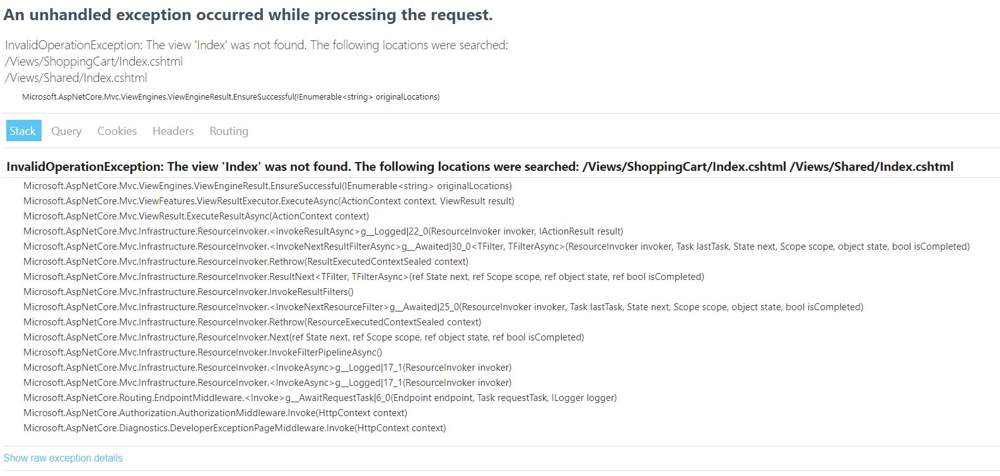

    > In this example the **Views/Home** folder should be renamed and the ASP.NET Core Web app should be rebuilt.

2. Open the **Event Viewer** and look for errors in **Application Logs**

    This example shows that the path in the web.config does not correctly point to the **MvcMusicStore.Core.dll**.

    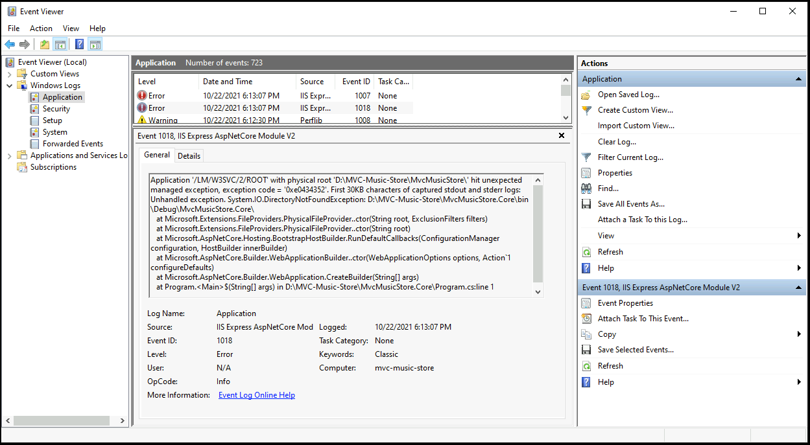

    > In this example the path in the `web.config` file was not properly set for the ASP.NET Core website's ContentRoot

## 2. Page not found
The ASP.NET Web app does not know about the ASP.NET Core Web app. You have to remember to **right-click -> build** the ASP.NET Core Web app before trying to test your changes.

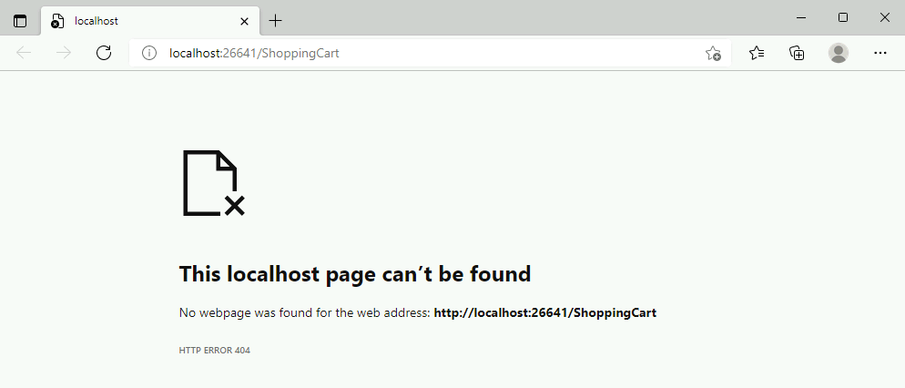

> Try building the ASP.NET Core app and then restarting the ASP.NET Website.


## 3. Typescript error TS6053 or IDE1100

You might see these errors in Visual Studio after editing the ASP.NET Core csproj file. These are not real errors in the solution.

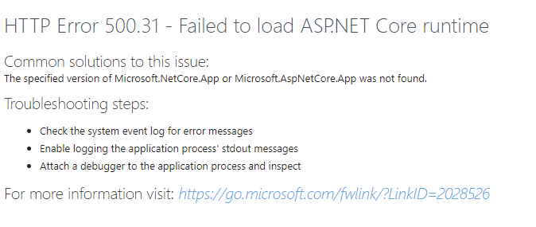

> Close and re-open Visual Studio to resolve these errors.

## 4. Failed to update database because the database is read-only

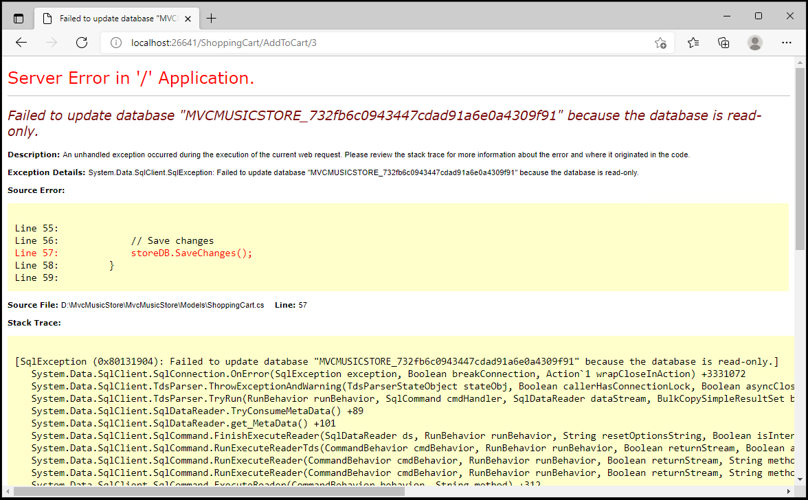

> Delete the database files from the downloaded sample and let the code rebuild them

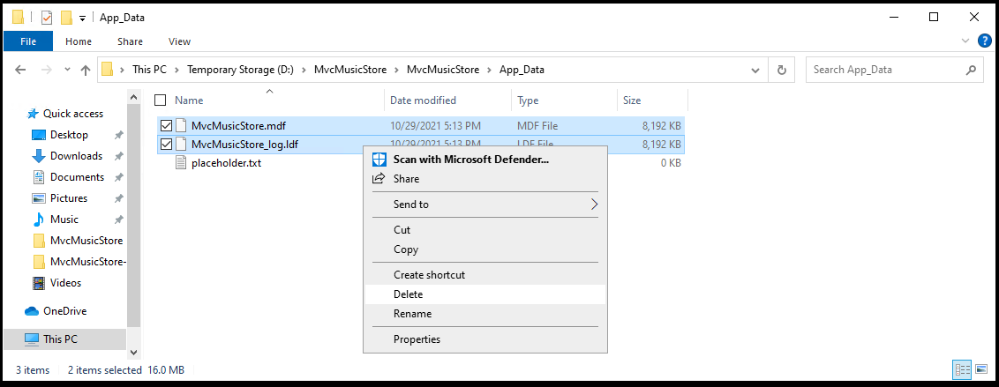
