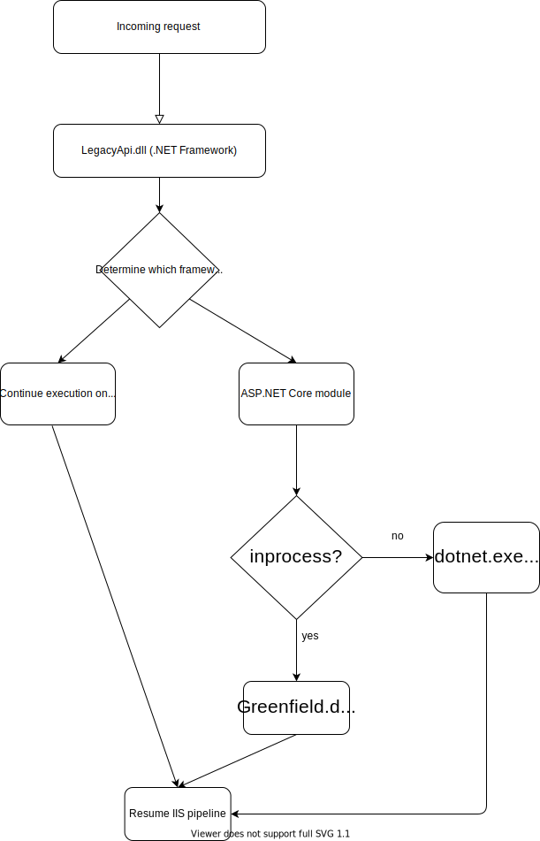

## Running ASP.NET and ASP.NET Core in the same IIS pipeline

This is an experiment showing how to run ASP.NET WebAPI and ASP.NET Core in the IIS pipeline (it can be in process or out of process). The idea is to experiment with ways to use any custom logic to determine which routes go to ASP.NET Core and which ones go to ASP.NET. This can aid is porting large applications to ASP.NET Core in a route by route manner.

### Instructions

1. Make sure IIS is running in 64 bit more for ASP.NET.

    

1. Mark LegacyApi as the startup project and run the application.
1. Navigating to /api/weather/* will take you to the ASP.NET Core application, and all other URLs go to the ASP.NET application.

### How it works

1. The ASP.NET Core module is a regular IIS module. It can be installed into an IIS based project:

    ```xml
    <system.webServer>
        <handlers>
            <remove name="ExtensionlessUrlHandler-Integrated-4.0" />
            <remove name="OPTIONSVerbHandler" />
            <remove name="TRACEVerbHandler" />
            <add name="ExtensionlessUrlHandler-Integrated-4.0" path="*." verb="*" type="System.Web.Handlers.TransferRequestHandler" modules="AspNetCoreModuleV2" preCondition="integratedMode,runtimeVersionv4.0" />
        </handlers>
        <aspNetCore processPath="dotnet" arguments="bin\Greenfield\Greenfield.dll" stdoutLogEnabled="false" stdoutLogFile=".\logs\stdout" hostingModel="outofprocess" />
    </system.webServer>
    ```

    We've installed the ASP.NET Core module into the ASP.NET MVC project that pointed it to our `Greenfield` application. Notice we've done this
    after the `ExtensionlessUrlHandler` module, this is important because we're going to use the ASP.NET MVC project to determine which routes should go to ASP.NET Core.

1. In [Global.asax.cs](LegacyApi/Global.asax.cs#L21-L34) we're using `Application_PostResolveRequestCache` which runs after the routing module and we use the URL to determine if we want to route to ASP.NET Core via [Context.RemapHandler](https://docs.microsoft.com/en-us/dotnet/api/system.web.httpcontext.remaphandler?view=netframework-4.8#System_Web_HttpContext_RemapHandler_System_Web_IHttpHandler_).
1. Setting the handler to null allows the next module to run in the pipeline and it will execute the ASP.NET Core module.

**NOTE: The hostingModel can be either inprocess or outofprocess. Either works. See below for the list of limiations for each mode.**

## Diagram
<p align="center">
    
</p>

## Limitations

- When using **inprocess** mode: 
  - It is likely that .NET Framework and .NET Core will run OK together (though this isn't officially supported).
  - ~~Some diagnostics are also likely hosed (dumps, debugging, etw etc.)~~
  - It isn't possible to run multiple applications in same app pool (in process mode).
  - Communcation between runtimes works if you use COM or any other interop technologies.
  - Native dlls that have the same name can conflict within the same process.
  - There are 2 separate CLRs in the process that don't know about each other running ServerGC.

## Benefits
- Managed and Native IIS modules run for both ASP.NET and ASP.NET Core applications
- Deployment process can pretty much stay the same (as long as you add the ASP.NET Core application as a payload within the ASP.NET application)
- Allows routing to ASP.NET Core based on arbitrary application logic.
